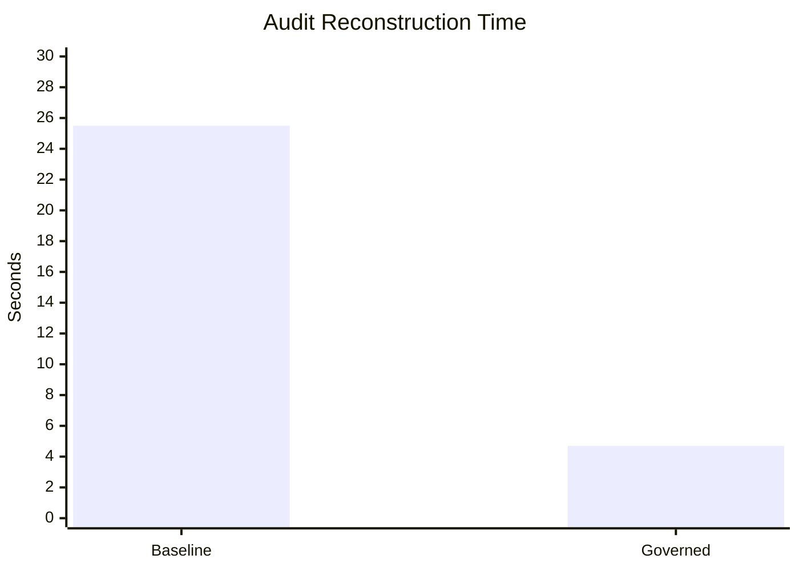

# Governance Benchmark Report

## Experiment setup

- Benchmark type: deterministic offline governance benchmark
- Scenario count: 4 scenarios, 2 agent modes
- Baseline agent: LangChain-style baseline without governance controls
- Governed agent: same task path plus Token Governor middleware and ARO audit logging

## Baseline results

| Metric | Value |
| --- | --- |
| policy_violation_rate | 100% |
| token_overspend_rate | 100% |
| persona_drift_rate | 100% |
| audit_reconstruction_time | 25.50s |

## Governed results

| Metric | Value |
| --- | --- |
| policy_violation_rate | 0% |
| token_overspend_rate | 0% |
| persona_drift_rate | 0% |
| audit_reconstruction_time | 4.70s |

## Analysis

The governed agent prevents restricted tool execution, stays within token
budget, preserves the expected persona, and emits a portable evidence object
that reduces audit reconstruction effort.

```mermaid
xychart-beta
    title "Violation and Drift Rates"
    x-axis ["Policy", "Budget", "Persona"]
    y-axis "Rate" 0 --> 1
    bar [1.0, 1.0, 1.0]
    bar [0.0, 0.0, 0.0]
```

